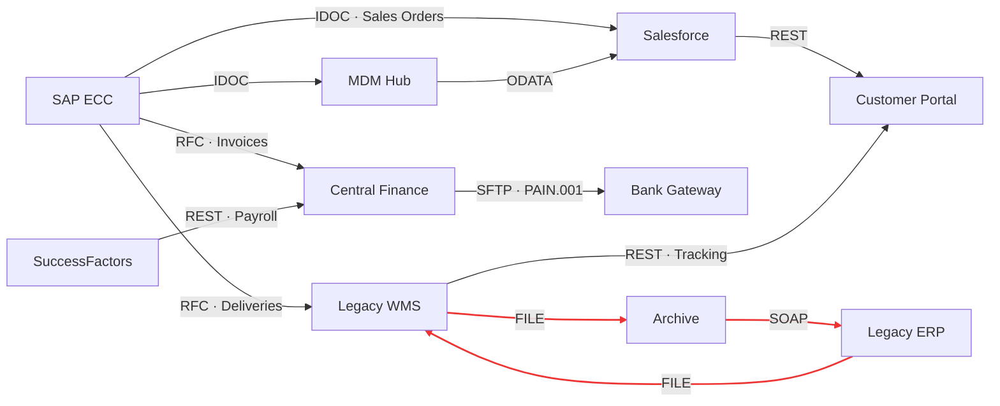

# Hermes — Integration Landscape Impact Analyzer

Given any system failure in an enterprise integration landscape, Hermes tells you exactly which
business processes are affected, how badly, and in what order to bring systems back up — before
your manager has to ask.

Every SAP shop has a Word document or Confluence page that supposedly maps the integration
landscape. Nobody trusts it, nobody updates it, and it is useless in an incident. Hermes is the
living, queryable version of that document with algorithmic intelligence on top: the landscape is
a directed graph, an outage is a graph traversal, and a recovery plan is a topological sort.

Built with Java 21 and Spring Boot 3.5. No graph library — the graph, the traversals and the
scoring model are implemented from scratch.

## Quick start

```
.\mvnw.cmd spring-boot:run        # Windows
./mvnw spring-boot:run            # Linux / macOS
```

The app starts on port 8080 and loads [`landscape.json`](src/main/resources/landscape.json) —
a realistic landscape of 18 systems (SAP ECC, S/4HANA, a CPI tenant, Salesforce, ServiceNow,
legacy WMS/ERP, bank and EDI gateways, portals) connected by 39 integrations, including one
deliberate dependency cycle. Then break something:

```
curl -X POST http://localhost:8080/analysis/impact \
     -H "Content-Type: application/json" \
     -d '{"system":"SAP_ECC","degradationType":"COMPLETE_OUTAGE"}'
```

Or run the whole scenario: `.\scripts\demo.ps1` (there is also a [`demo.http`](scripts/demo.http)
for the VS Code / IntelliJ REST clients).

## What an analysis looks like

`POST /analysis/impact` for a complete SAP ECC outage answers in ~20 ms with a ranked report
(the full capture is in [`docs/sample-impact-report.json`](docs/sample-impact-report.json)):

```
IMPACT REPORT — SAP_ECC COMPLETE_OUTAGE                    priority: P1
14 of 17 remaining systems affected · 33 integrations impacted · max cascade depth 2

CRITICAL
  LEGACY_WMS        DIRECT   ORPHANED   24.5   deliveries stop, no alternate feed
  SALESFORCE        DIRECT   ORPHANED   23.0   orders + master data + pricing all starved

HIGH
  SAP_S4            CASCADE  PARTIAL    19.5   goods movements from WMS stop arriving
  CUSTOMER_PORTAL   CASCADE  ORPHANED   18.5   two hops away, both feeds dead
  FINANCE_SYSTEM    DIRECT   PARTIAL    18.0   HR payroll + bank statements still flow
  ...

RECOVERY SEQUENCE (Kahn's algorithm, waves = parallel restore groups)
  wave 1  SAP_ECC          safe starting point, no upstream deps in affected set
  wave 2  LEGACY_WMS       ⚠ cycle break point — reconcile LEGACY_ERP feed manually
  wave 3  SAP_S4, ARCHIVE_SYSTEM
  wave 4  FINANCE_SYSTEM, MDM_HUB, EDI_GATEWAY ...

LANDSCAPE WARNINGS
  Cycle detected: ARCHIVE_SYSTEM -> LEGACY_ERP -> LEGACY_WMS -> ARCHIVE_SYSTEM
```

Note what the classification is doing: **FINANCE_SYSTEM is PARTIAL** (payroll and bank-statement
feeds are healthy, so it degrades rather than dies) while **SALESFORCE is ORPHANED** — its only
two feeds are SAP ECC directly and the MDM hub, which is itself downstream of ECC. A flat
"everything downstream is affected" list cannot make that distinction; tracking per-consumer
sourcing status can.

## The data model

An integration landscape is naturally a directed graph:



- **Nodes** are systems, each with an admin-entered `businessCriticality` (1–10) and a live status.
- **Edges** are iFlows / interfaces with protocol, payload type, business process, criticality and
  an SLA class (`REAL_TIME`, `NEAR_REAL_TIME`, `BATCH`).
- The graph is a hand-rolled adjacency list (`HashMap<String, List<IntegrationEdge>>`, kept in
  both directions). No JGraphT: the impact engine needs bidirectional adjacency, metadata-aware
  traversal and custom failure semantics, and owning ~150 lines of graph code is cheaper than
  bending a library to that.

## The algorithms

**Impact propagation — BFS, deliberately.** From the failed node, breadth-first over outgoing
edges with a visited set. BFS discovers systems in *rings*: every system's hop distance is its
shortest path from the failure, which maps directly to the DIRECT (1 hop) / CASCADE (2+ hops)
classification an operations bridge call thinks in. DFS would find the same set but destroys the
distance semantics. On top of the ring, each affected system is classified by sourcing:
**ORPHANED** if every inbound feed originates from the affected set (complete data starvation),
**PARTIAL** if at least one healthy source remains.

**Recovery sequencing — Kahn's algorithm, not recursive DFS topo-sort.** Two reasons. Kahn's
processes the frontier of zero-in-degree nodes level by level, which naturally yields *restore
waves* — groups with no interdependencies that can be brought up in parallel. And its failure
mode is the feature: when the ready-queue empties while nodes remain, those nodes sit on a cycle.
Hermes then picks a deterministic *cycle break point* (the failed system itself if applicable,
otherwise a true cycle member with the fewest unresolved feeds), flags it for manual
reconciliation, and continues the sort. One legacy loop never degrades the whole recovery plan.

**Cycle detection — iterative three-color DFS.** Real landscapes have cycles; someone always
built a callback iFlow that re-triggers the original flow. Hermes never treats a cycle as an
error: every traversal is cycle-safe, and each cycle is surfaced as a landscape warning (the
bundled landscape ships one on purpose: `WMS → Archive → Legacy ERP → WMS`).

**Scoring — where domain knowledge meets the graph.**

```
system severity   = (businessCriticality × slaWeight + fanOut × 1.5 + orphanBonus) × degradationFactor
integration score = (edgeCriticality × slaWeight + downstreamConsumers × 2 + junctionBonus) × degradationFactor
```

`slaWeight` comes from the tightest affected SLA (a real-time feed failing hurts now; a batch
feed buys you until tonight), `fanOut` measures how far a system re-broadcasts the damage, and
`downstreamConsumers` makes an edge feeding a 10-consumer junction outrank an equally critical
edge feeding a leaf. Severity bands map to ITSM priorities: a high-criticality real-time junction
failing is a P1 business event; a batch feed to a leaf is a P4 note. The weights are calibrated
for a revenue-centric ERP landscape and live in one class
([`CriticalityScorer`](src/main/java/com/hermes/engine/CriticalityScorer.java)) precisely so a
pharma or banking shop could re-weight them.

## API

| Method | Path                          | Purpose                                        |
|--------|-------------------------------|------------------------------------------------|
| POST   | `/landscape/systems`          | Register a system node                          |
| POST   | `/landscape/integrations`     | Register an integration edge (iFlow)            |
| GET    | `/landscape/health-map`       | Full graph with current node statuses           |
| GET    | `/landscape/warnings`         | Cycles, single-source consumers, isolated nodes |
| GET    | `/landscape/statistics`       | Protocol/SLA distribution, fan-out, top-critical systems |
| POST   | `/landscape/reset`            | Reset all statuses to HEALTHY                   |
| POST   | `/analysis/impact`            | Run impact analysis for a degraded system       |
| GET    | `/analysis/impact/{reportId}` | Retrieve a stored report                        |
| POST   | `/analysis/recovery-sequence` | Ordered recovery plan for a failure             |

Sample captures live in [`docs/`](docs): the ECC outage report, landscape statistics, warnings
and a recovery sequence for a system sitting on the cycle.

An impact analysis marks node statuses on the health map (the failed system `DOWN`, orphaned
consumers `DOWN`, partially-sourced ones `DEGRADED`) so the landscape visibly reflects the
incident until you `POST /landscape/reset`.

## Engineering notes

- **Validation & errors:** all payloads are bean-validated; every failure mode maps to an
  RFC 9457 problem detail (400 with per-field errors, 404 unknown system/report, 409 duplicate
  id). Stack traces never leave the server.
- **Concurrency:** the graph sits behind a `ReadWriteLock` — concurrent analyses share the read
  lock, registrations take the write lock. Reports are kept in a bounded LRU (last 100).
- **Optional API key:** set `hermes.security.api-key` and every request except the health probe
  must send `X-API-Key`; comparison is constant-time. Left empty for local demos.
- **Config:** point `hermes.landscape.path` at an external JSON file to load your own landscape.
- **Tests:** 37 tests — unit coverage for the graph, cycle detector, impact engine (orphaned vs
  partial, ring classification, score scaling) and sequencer (waves, criticality ordering, cycle
  break selection), plus an end-to-end MockMvc suite against the bundled landscape.

```
.\mvnw.cmd test
```

## Landscape statistics (bundled data)

From `GET /landscape/statistics`: 18 systems, 39 integrations, average fan-out 2.0, 6 junction
systems, 1 cycle. SAP ECC tops the criticality ranking (criticality 10, fan-out 8). Protocol mix:
REST 12, IDOC 8, FILE 5, ODATA 5, SOAP 2, SFTP 2, RFC 2, JDBC 2, AS2 1 — roughly what a mid-size
SAP landscape really looks like. SLA mix: 6 real-time, 13 near-real-time, 20 batch.
